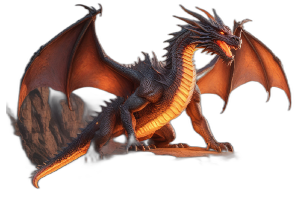
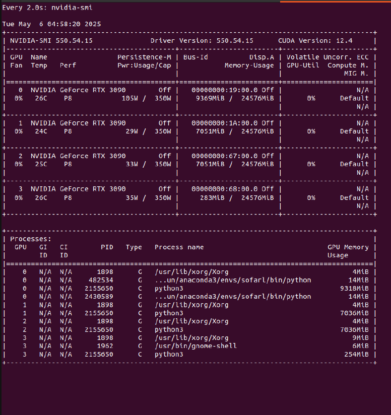

# Creative Partner: Transform Text Ideas into Images and 3D Models

## Overview

**Creative Partner** is a Python application that turns your text ideas into stunning images and interactive 3D models, with persistent memory across sessions. It uses a local large language model (LLM) to expand your prompts, generates images, converts them to 3D models, and remembers your creations for future reference—all through a simple Gradio web interface.

---

## Features

- **Prompt Expansion:** Interprets and enhances your text prompts using a local LLM.
- **Text-to-Image Generation:** Creates images from enhanced prompts via a local text-to-image model (Openfabric integration).
- **Image-to-3D Model:** Converts generated images into interactive 3D models using a local image-to-3D model (Openfabric integration).
- **Image Background Removal:** Automatically removes the background from generated images before 3D model generation for optimal results.
- **Memory:** Remembers all your creations, allowing you to reference and remix them in future prompts using a persistent database.
- **User Interface:** Easy-to-use Gradio web app for input, viewing, and browsing your creative history.

---

## How It Works

### Pipeline Overview

The application follows a step-by-step pipeline to transform your ideas into visual and 3D creations, while maintaining memory for future reference:

1. **User Prompt Input:**  
   - You enter a creative idea or description into the Gradio web interface.

2. **Prompt Enhancement (Local LLM):**  
   - The application uses a locally hosted large language model to interpret and expand your prompt.
   - The LLM generates a more detailed, vivid, and creative description suitable for visual generation.

3. **Text-to-Image Generation (Openfabric App):**  
   - The enhanced prompt is sent to a text-to-image generation application via the Openfabric platform.
   - The Openfabric app processes the prompt and returns a high-quality image representing your idea.

4. **Image Background Removal:**  
   - The generated image undergoes automatic background removal.
   - This step ensures that the subject is isolated, which improves the quality and accuracy of the subsequent 3D model generation.

5. **Image-to-3D Model Generation (Openfabric App):**  
   - The background-removed image is sent to an image-to-3D model application, also via Openfabric.
   - This app analyzes the image and produces an interactive 3D model file (e.g., .glb format).

6. **Memory Storage:**  
   - Each step (original prompt, enhanced prompt, generated image, background-removed image, and 3D model) is saved in both short-term (session) and long-term (persistent) memory.
   - This allows you to reference, remix, or search for previous creations in future sessions.

7. **User Interaction:**  
   - The Gradio interface displays the enhanced prompt, generated image, and a 3D model viewer.
   - You can browse your creation history, search for past prompts, and use previous outputs as inspiration for new ideas.

#### Detailed Pipeline Flow

```
User Prompt
   │
   ▼
[Local LLM (Gemma 2 2B)]
   │  (Enhances prompt)
   ▼
[Text-to-Image App (Openfabric)]
   │  (Generates image)
   ▼
[Background Removal (rembg)]
   │  (Removes image background)
   ▼
[Image-to-3D App (Hunyuan3D-2)]
   │  (Generates 3D model)
   ▼
[Memory System (SQLite)]
   │
   ▼
[Gradio UI: Display + History + Search]
```

- **Short-Term Memory:** Maintains context within your current session for coherent follow-up prompts.
- **Long-Term Memory:** Stores all creations in a persistent database (e.g., SQLite), enabling you to search and reuse past ideas.

---

## Models and Libraries Used

### Prompt Enhancement (LLM)
- **Model:** [Gemma 2 2B (Instruction Tuned)](https://huggingface.co/google/gemma-2b)
- **Why:** Gemma 2 2B is a compact, instruction-tuned LLM that runs efficiently on local hardware. It is capable of expanding simple prompts into rich, detailed descriptions suitable for generative models, while preserving privacy and reducing dependency on external APIs.

### Text-to-Image Generation
- **Model:** Openfabric text-to-image app (model may vary)
- **Why:** Using Openfabric allows flexible integration of high-quality local or remote generative models, abstracting away the backend details and making it easy to swap or upgrade the image generation model.

### Image Background Removal
- **Library:** [rembg](https://github.com/danielgatis/rembg)
- **Why:** `rembg` is a fast, reliable, and easy-to-use tool for removing backgrounds from images. This is essential for 3D model generation, as it ensures the subject is cleanly separated from the background, improving the quality of the resulting mesh.

#### Example Images

- **Generated image:**  
  
- **With removed background:**  
  

Notice how the second image isolates the subject, making it ideal for 3D reconstruction.

### Image-to-3D Model Generation
- **Model:** [Tencent Hunyuan3D-2](https://github.com/Tencent/Hunyuan3D-2)
- **Why:** Hunyuan3D-2 is a state-of-the-art model for reconstructing 3D meshes from single images. It produces high-quality, interactive 3D models and is suitable for local deployment.

---

## Openfabric API for Image Generation

This application uses the Openfabric API to generate images from enhanced prompts.

### API Details

- **Base URL:**  
  `https://c25dcd829d134ea98f5ae4dd311d13bc.node3.openfabric.network`

- **Execution Endpoint (submit prompt):**  
  `POST /execution`

- **Image Retrieval Endpoint:**  
  `GET /resource`

#### Step 1: Submit Your Text Prompt

Send a POST request to `/execution` with your prompt in JSON format:

```json
{
  "prompt": "A dragon on a road"
}
```

**Example cURL:**
```bash
curl -X POST "https://c25dcd829d134ea98f5ae4dd311d13bc.node3.openfabric.network/execution" \
  -H "accept: application/json" \
  -H "Content-Type: application/json" \
  -d '{"prompt": "A dragon on a road"}'
```

#### Step 2: Get the Image Reference ID

The API responds with a JSON object containing a result path:

```json
{
  "result": "data_blob_ff682ba4346814f4ba85d917836ac08ad7a270a6da10cb5ff419c09f7fba1e35/resources"
}
```

Extract the resource ID (the part before `/resources`).

#### Step 3: Retrieve the Generated Image

Send a GET request to `/resource` with the `reid` parameter set to your resource ID:

```bash
curl -X GET "https://c25dcd829d134ea98f5ae4dd311d13bc.node3.openfabric.network/resource?reid=data_blob_ff682ba4346814f4ba85d917836ac08ad7a270a6da10cb5ff419c09f7fba1e35/resources" \
  -H "accept: application/json"
```

This returns the generated image as a binary blob, which is saved and processed by the application.

**Notes:**
- Always use `application/json` for the POST request.
- The image response is a binary blob suitable for direct saving or rendering.

---

## Data Storage System

- **Database:** SQLite (file-based, no server required)
- **Location:** `app/datastore/creations.db`
- **What is stored:**  
  - Original prompt
  - Enhanced prompt
  - Tags (for search)
  - Paths to generated image, background-removed image, and 3D model
  - Timestamps and unique generation IDs

This enables persistent memory, search, and remixing of all your creations across sessions.

---

## Usage Instructions

### 1. **Setup**

- Download and unzip the `ai-test-new.zip` file that contains the code.
- Enter the project directory:
  ```bash
  cd ai-test-new
  ```

- Run the setup script to install dependencies and prepare the environment:
  ```bash
  bash application_setup.sh
  ```

- Activate the virtual environment:
  ```bash
  source venv/bin/activate
  ```

- **Install Hugging Face Hub and Log In (Required for Gemma and Hunyuan3D-2 Models Download):**
  - Install the Hugging Face Hub library:
    ```bash
    pip install huggingface_hub
    ```
  - Generate a Hugging Face User Access Token with `read` permissions. Follow the instructions here: [Hugging Face Tokens Documentation](https://huggingface.co/docs/hub/en/security-tokens).
  - Log in using the command line. You will be prompted to paste your access token:
    ```bash
    huggingface-cli login
    ```
  - *Note: You only need to do this once. Logging in allows the application to download the Gemma model automatically the first time it runs.*

- Ensure your local LLM and required generative models are downloaded and accessible. (Logging in above handles the Gemma model download).

- Make sure the Openfabric Core is running and you are logged in.

### 2. **Run the Application**

- Start the Gradio web app:
  ```bash
  python app/run_gradio.py
  ```

- Open your browser and go to [http://localhost:7860](http://localhost:7860).

### 3. **Create and Explore**

- **Describe your idea** in the prompt box and click "Generate".
- **View the enhanced prompt**, generated image, and interactive 3D model.
- **Browse your creation history** and search for past prompts.
- **Reference previous creations** in new prompts for remixing.

---

## Memory System

- **Short-Term Memory:**  
  Remembers your current session's context for coherent follow-up prompts.

- **Long-Term Memory:**  
  Stores all prompts, enhanced prompts, images, background-removed images, and 3D models in a persistent database (e.g., SQLite), allowing you to search and reuse past creations.

---

## Requirements

- Python 3.8+
- Openfabric SDK
- Gradio
- torch, transformers, Pillow, rembg, and other dependencies (installed via `application_setup.sh`)
- Local LLM and generative models (downloaded and configured)
- SQLite for persistent memory

---

## Hardware Requirements

Running this application locally requires significant computational resources, especially GPU memory (VRAM), due to the size and complexity of the AI models involved.

**Minimum Requirements:**

- **CPU:** Modern multi-core processor (e.g., Intel Core i5/i7 8th Gen+, AMD Ryzen 5/7 3000 series+).
- **RAM:** 16 GB RAM (More is recommended, especially if running models on CPU).
- **GPU:** NVIDIA GPU with CUDA support.
- **VRAM (GPU Memory):** **12 GB VRAM**. This is crucial for loading and running the models efficiently. Running with less VRAM may lead to out-of-memory errors or extremely slow performance.
- **Storage:** ~40 GB free disk space (for models, dependencies, virtual environment, and generated data). SSD is highly recommended for faster model loading.

**Recommended Requirements:**

- **CPU:** High-performance multi-core processor (e.g., Intel Core i7/i9 10th Gen+, AMD Ryzen 7/9 5000 series+).
- **RAM:** 32 GB RAM or more.
- **GPU:** NVIDIA RTX 30xx/40xx series or equivalent workstation GPU (e.g., A-series).
- **VRAM (GPU Memory):** **24 GB VRAM or more**. This provides a much smoother experience, especially when handling larger images or potentially running multiple models concurrently in future extensions.
- **Storage:** 50 GB+ free space on a fast NVMe SSD.

**Key Considerations:**

- **VRAM is the Bottleneck:** The primary constraint is GPU VRAM.
    - **Gemma 2 2B (LLM):** Requires approximately 5-6 GB VRAM when loaded in `float16` (half-precision), potentially more in `float32`.
    - **Hunyuan3D-2 (Image-to-3D):** This model is significantly larger, requiring **at least 20-24 GB VRAM** for efficient operation according to typical usage patterns for models of this size. The exact requirement can vary based on batch size and image resolution.
- **Model Loading:** Both models need to be loaded into VRAM. While the application might load them sequentially depending on the workflow, having enough VRAM to hold the largest model (Hunyuan3D-2) plus overhead for processing is essential.
- **CPU Fallback:** While `torch` allows CPU execution (`device='cpu'`), running these large models on the CPU will be **extremely slow** and is generally not practical for interactive use. It also requires substantial system RAM.
- **Operating System:** Linux is recommended due to better CUDA support and tooling commonly used in ML development. Windows with WSL2 or native Python/CUDA can also work but might require more setup.

**Example GPU Memory Usage:**

The following image shows the output of `nvidia-smi` on a system with multiple NVIDIA RTX 3090 GPUs (24GB VRAM each) while running components of this application:



*Discussion:*
- **GPU 0:** Shows a `python3` process (PID 2155650) using approximately **9318 MiB (around 9.1 GB)** of VRAM. This likely corresponds to the **Gemma 2 2B LLM** being loaded and active for prompt enhancement.
- **GPU 1 & 2:** Show `python3` processes (PID 2155650) using approximately **7036 MiB (around 6.9 GB)** each. This might represent parts of the image generation or 3D pipeline, or potentially distributed loading if configured (though the primary models are usually loaded onto a single device unless specified otherwise). *Note: The exact process mapping depends on how the application assigns tasks to GPUs.* The Hunyuan3D-2 model, when fully active, would consume significantly more VRAM (closer to the 20-24GB range mentioned). This snapshot might capture a moment before or after its peak usage, or potentially only a portion of the model is active/loaded on these specific GPUs at this instant.
- **GPU 3:** Shows minimal usage by system processes (Xorg, gnome-shell) and a smaller `python3` process (254 MiB), indicating it's likely not actively running a major AI model at this moment.

This example highlights that running the full pipeline requires a GPU with significant memory capacity, reinforcing the recommended 24GB VRAM for a smooth experience.

**If you have limited VRAM:**
- You might experience crashes or very slow generation times.
- Consider using cloud-based GPU instances if local hardware is insufficient.
- Explore model quantization techniques (like bitsandbytes for LLMs) if applicable and implemented, although this often comes with a trade-off in accuracy (Note: Quantization is not implemented by default in this project setup).

---

## Example Workflow

1. **User:**  
   "Create a glowing dragon standing on a cliff at sunset."

2. **System:**  
   - Expands the prompt.
   - Generates an image.
   - Removes the background from the image.
   - Generates a 3D model from the background-removed image.
   - Saves the creation to memory.

3. **User:**  
   "Make the same dragon, but now breathing fire."

4. **System:**  
   - Finds the previous dragon.
   - Updates the prompt and generates new outputs.

---

## Example Code Snippets

### Prompt Enhancement (Gemma 2 2B)

```python
# filepath: app/core/llm_interface.py
from transformers import AutoTokenizer, AutoModelForCausalLM
import torch

tokenizer = AutoTokenizer.from_pretrained("google/gemma-2b-it")
model = AutoModelForCausalLM.from_pretrained(
    "google/gemma-2b-it",
    device_map="auto",
    torch_dtype=torch.float32
)

def enhance_prompt(prompt):
    full_prompt = f"Enhance this idea for image generation: {prompt}\nEnhanced prompt:"
    inputs = tokenizer(full_prompt, return_tensors="pt").to(model.device)
    with torch.no_grad():
        outputs = model.generate(**inputs, max_new_tokens=100)
    enhanced = tokenizer.decode(outputs[0], skip_special_tokens=True)
    return enhanced.split("Enhanced prompt:")[-1].strip()
```

### Background Removal (rembg)

```python
# filepath: app/core/llm_interface.py
from PIL import Image
from rembg import remove

def remove_background(image_path, output_path):
    input_image = Image.open(image_path)
    output_image = remove(input_image)
    output_image.save(output_path)
    return output_path
```

### 3D Model Generation (Hunyuan3D-2)

```python
# filepath: app/core/llm_interface.py
from hy3dgen.shapegen import Hunyuan3DDiTFlowMatchingPipeline
import torch

pipeline = Hunyuan3DDiTFlowMatchingPipeline.from_pretrained(
    'tencent/Hunyuan3D-2',
    device='cuda' if torch.cuda.is_available() else 'cpu'
)

def generate_3d(image_path_nobg, output_model_path):
    mesh = pipeline(image=image_path_nobg)[0]
    mesh.export(output_model_path)
    return output_model_path
```

### Database Interaction (SQLite)

```python
# filepath: app/core/db_manager.py
import sqlite3
from datetime import datetime

DB_PATH = "app/datastore/creations.db"

def save_generation(original_prompt, enhanced_prompt, tags):
    conn = sqlite3.connect(DB_PATH)
    cursor = conn.cursor()
    timestamp = datetime.now()
    tags_str = ",".join(tags)
    cursor.execute("""
        INSERT INTO generations (original_prompt, enhanced_prompt, tags, created_at)
        VALUES (?, ?, ?, ?)
    """, (original_prompt, enhanced_prompt, tags_str, timestamp))
    generation_id = cursor.lastrowid
    conn.commit()
    conn.close()
    return generation_id

def update_paths(generation_id, image_path=None, bg_removed_path=None, model_path=None):
    conn = sqlite3.connect(DB_PATH)
    cursor = conn.cursor()
    updates = []
    params = []
    if image_path:
        updates.append("image_path = ?")
        params.append(image_path)
    if bg_removed_path:
        updates.append("bg_removed_path = ?")
        params.append(bg_removed_path)
    if model_path:
        updates.append("model_path = ?")
        params.append(model_path)
    if updates:
        params.append(generation_id)
        sql = f"UPDATE generations SET {', '.join(updates)} WHERE id = ?"
        cursor.execute(sql, tuple(params))
        conn.commit()
    conn.close()
```

## User Interface (Gradio)

- **Framework:** [Gradio](https://www.gradio.app/)
- **Why:** Gradio provides a fast, flexible way to build interactive web interfaces for machine learning applications, allowing users to interact with models in real time through their browser.

### How Gradio is Used

This application uses Gradio to create a modern, user-friendly web interface that lets you:
- Enter creative prompts and submit them for AI processing.
- View the AI-enhanced prompt, generated image, and interactive 3D model in real time.
- Browse your creation history and search past prompts.
- Clear outputs and refresh results with a single click.

The interface is built with Gradio’s `Blocks` API for a responsive layout, including:
- **Textbox** for prompt input.
- **Buttons** for generating outputs, clearing, refreshing, and searching.
- **Image** and **HTML** components for displaying generated images and 3D model previews.
- **DataFrame** for browsing and searching your creation history.

All interactions are handled live in the browser, with no need for manual file handling or command-line usage.

For more on Gradio, see the [official documentation](https://www.gradio.app/).

---

## Model Links

- **Gemma 2 2B:** [https://huggingface.co/google/gemma-2b](https://huggingface.co/google/gemma-2b)
- **Tencent Hunyuan3D-2:** [https://github.com/Tencent/Hunyuan3D-2](https://github.com/Tencent/Hunyuan3D-2)
- **rembg (background remover):** [https://github.com/danielgatis/rembg](https://github.com/danielgatis/rembg)

---
